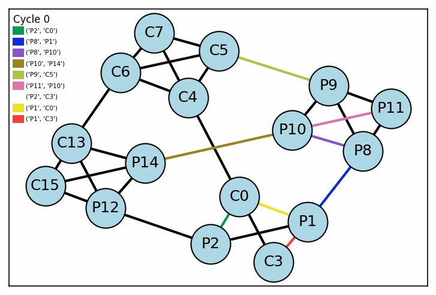

## Software Scheduled Networking (SSN) Demo

This demo shows minimal and non-minimal routing of data transfers in a dragonfly network. It's a toy example inspired by the paper [A software-defined tensor streaming multiprocessor for large-scale machine learning](https://dl.acm.org/doi/10.1145/3470496.3527405)
You can try it out [here](https://madhav-malhotra-groq-ssn-demo-frontend-acfxev.streamlit.app/).
